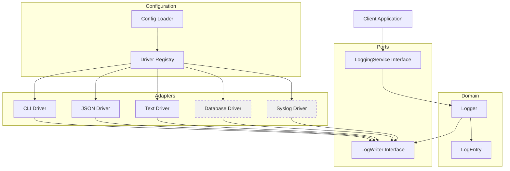

# PlentyTelemetry

```mermaid
graph TD
    %% Client Layer
    Client[Client Application]
    
    %% Ports Layer (Interfaces)
    subgraph "Ports"
        LoggingService[LoggingService Interface]
        LogWriter[LogWriter Interface]
    end
    
    %% Domain Layer
    subgraph "Domain"
        Logger[Logger]
        LogEntry[LogEntry]
    end
    
    %% Configuration Layer
    subgraph "Configuration"
        Registry[Driver Registry]
        ConfigLoader[Config Loader]
    end
    
    %% Adapters Layer
    subgraph "Adapters"
        CLI[CLI Driver]
        JSON[JSON Driver] 
        Text[Text Driver]
        Database[Database Driver]
        Syslog[Syslog Driver]
    end
    
    %% Relationships
    Client --> LoggingService
    LoggingService --> Logger
    Logger --> LogWriter
    Logger --> LogEntry
    
    ConfigLoader --> Registry
    Registry --> CLI
    Registry --> JSON
    Registry --> Text
    Registry --> Database
    Registry --> Syslog
    
    CLI --> LogWriter
    JSON --> LogWriter
    Text --> LogWriter
    Database --> LogWriter
    Syslog --> LogWriter
    
    %% Styling for future drivers
    style Database fill:#f0f0f0,stroke-dasharray: 5 5
    style Syslog fill:#f0f0f0,stroke-dasharray: 5 5
```
